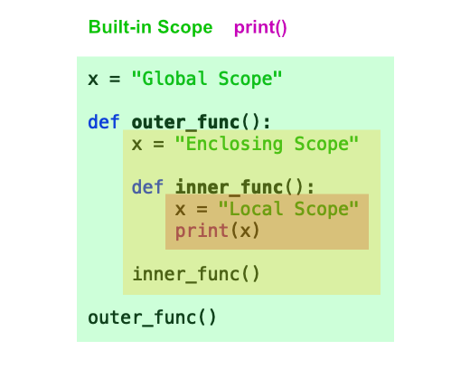

# Data types, flow control, classes

This folder contains markdown outlining everything we covered in day 1 of the workshop. 

And for no good reason, here is a neat little visualisation showing how scoping affects variables in functions. 

Try it out in a notebook. What do you think it will print?

